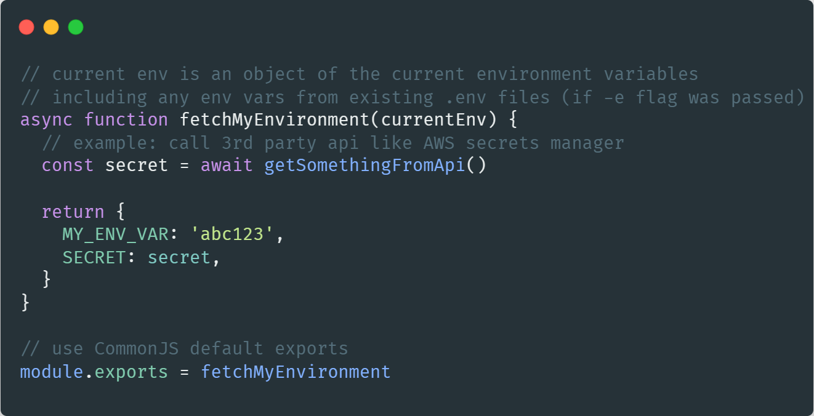
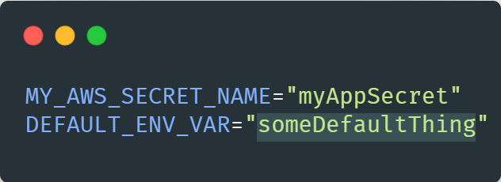

# envtk


[](https://oclif.io)

[](https://github.com/oclif/hello-world/blob/main/LICENSE)


## Features

- run commands with preloaded environment variables from a javascript file (supports async)
- run commands with preloaded environment variables from an existing .env file
- output the resulting environment variables as JSON for integration with other scripting languages

## Installation
Currently there are 2 ways of installing envtk

### NPM
envtk can be installed via [npm](https://www.npmjs.com/package/envtk):

```bash
  $ npm install -g envtk
```

### Binaries
Binaries for each OS can be downloaded from the [releases page](https://github.com/Fatih-Ertikin/envtk/releases)

Refer to the installation docs for each OS on how to install envtk.

## Quickstart

1. Create a javascript file (we'll call it `myScript.js`) and default export a function that returns an object:

<p align="center">
  
</p>

2. (optional) Create a .env file with defaults to include, lets call it `defaults.env`:
<p align="center">
  
</p>

3. run the envtk `run` command and reference the files created above, we will execute the [printenv](https://www.ibm.com/docs/en/aix/7.1?topic=p-printenv-command) command to see all current environment variables:

```bash
  $ npx envtk run printenv -s myScript.js -e defaults.env
```

will result in the following output:

```bash
MY_ENV_VAR=abc123
SECRET=SomethingFromAnApi
MY_AWS_SECRET_NAME=myAppSecret
DEFAULT_ENV_VAR=someDefaultThing
```

Note: we see the result printed because we ran `printenv`. If we had let's say a project that started with `npm run dev` and we passed that as command (so `envtk run "npm run dev" -s myScript.js -e defaults.env`, that project would now have access to the above environment variables via `process.env`

## Table of contents
* [Features](#features)
* [Installation](#installation)
* [Quickstart](#quickstart)
* [Motives](#otives)


## Motives

I noticed that a lot of populair frameworks, infrastructure tooling or other 3rd party services make use of environment variables or .env files but provide no way to load them from a 3rd pary secret manager (for example [AWS Secrets Manager](https://docs.aws.amazon.com/secretsmanager/latest/userguide/intro.html)).

While tooling like [dotenv-vault](https://www.dotenv.org/docs/quickstart) provides alot of functionality for safely managing secrets/environment variables, not everyone uses or can use dotenv-vault. This project aims to be a simple alternative tool for retrieving your secrets from wherever: a 3rd pary API, encrypted database, whatever and then passing those variables to the next step in your startup/deploy pipeline.

  # Usage

  <!-- usage -->
```sh-session
$ npm install -g envtk
$ envtk COMMAND
running command...
$ envtk (--version)
envtk/2.0.3 linux-x64 node-v18.16.0
$ envtk --help [COMMAND]
USAGE
  $ envtk COMMAND
...
```
<!-- usagestop -->

  # Commands

  <!-- commands -->
* [`envtk help [COMMANDS]`](#envtk-help-commands)

## `envtk help [COMMANDS]`

Display help for envtk.

```
USAGE
  $ envtk help [COMMANDS] [-n]

ARGUMENTS
  COMMANDS  Command to show help for.

FLAGS
  -n, --nested-commands  Include all nested commands in the output.

DESCRIPTION
  Display help for envtk.
```

_See code: [@oclif/plugin-help](https://github.com/oclif/plugin-help/blob/v5.2.10/src/commands/help.ts)_
<!-- commandsstop -->
